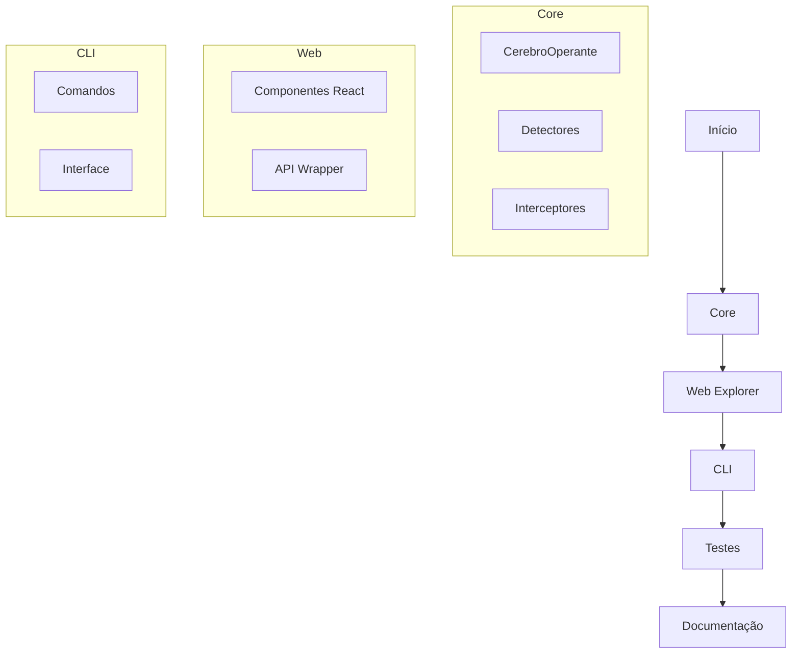

# Etapa 2 — Implementação do Código Base dos Pacotes

## 🎯 Objetivo

Implementar a estrutura e o código base dos três pacotes principais do monorepo Cérebro Operante:

- **@thugdacake/operante (core)**
- **cerebro-operante-explorer (web)**
- **cerebro-operante-cli (cli)**

## 📦 1. Core — @thugdacake/operante

### Estrutura
```
packages/core/
├── src/
│   ├── CerebroOperante.ts  # Classe principal
│   └── index.ts            # Exportações
```

### Implementação
- Classe `CerebroOperante` com métodos:
  - `iniciar()`: Inicializa o cérebro
  - `boasVindas()`: Exibe mensagem de boas-vindas
  - `interpretar(comando)`: Processa comandos
  - `detectHost()`: Detecta ambiente
  - `detectIA()`: Detecta presença de IA
  - `interceptAI()`: Intercepta IA host

- Constantes exportadas:
  - `versao`: Versão atual
  - `autor`: Criador do framework

### Exemplo de Uso
```typescript
import { CerebroOperante } from '@thugdacake/operante';

const cerebro = new CerebroOperante();
await cerebro.iniciar();
const status = await cerebro.interpretar('status');
```

## 🌐 2. Web Explorer — cerebro-operante-explorer

### Estrutura
```
packages/web-explorer/
├── src/
│   ├── components/
│   │   ├── CerebroChat.tsx
│   │   ├── OperanteExplorer.tsx
│   │   ├── LibraryExplorer.tsx
│   │   └── TestPanel.tsx
│   └── lib/
│       └── cerebroApi.ts
```

### Componentes
- `CerebroChat`: Interface de chat
- `OperanteExplorer`: Explorador de operações
- `LibraryExplorer`: Explorador de biblioteca
- `TestPanel`: Painel de testes

### API Wrapper
- `cerebroApi.ts`: Integração com o core

## 💻 3. CLI — cerebro-operante-cli

### Estrutura
```
packages/cli/
├── src/
│   ├── commands/
│   │   ├── status.js
│   │   ├── chat.js
│   │   └── test.js
│   └── bin/
│       └── cerebro-cli.js
```

### Comandos
- `status`: Verifica status do ambiente
- `chat`: Inicia chat interativo
- `test`: Executa testes

### Features
- Animações com `ora`
- Cores com `chalk`
- Interface com `inquirer`
- Integração com core

## 🔄 Fluxo de Implementação



## 📝 Próximos Passos

1. **Implementação**
   - Finalizar componentes React
   - Implementar comandos CLI
   - Integrar com core

2. **Testes**
   - Testes unitários
   - Testes de integração
   - Exemplos práticos

3. **CI/CD**
   - Configurar GitHub Actions
   - Automatizar build/test
   - Publicação NPM

## 📅 Status

- ✅ Core implementado
- 🚧 Web Explorer em progresso
- 🚧 CLI em progresso
- ⏳ Testes pendentes
- ⏳ CI/CD pendente

---

**Data:** 21/05/2024
**Responsável:** Thug Developer
