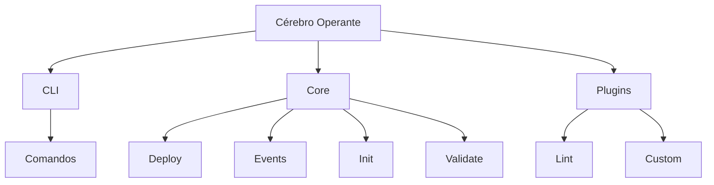

# 🎯 Introdução

## O que é o Cérebro Operante?

O Cérebro Operante é um framework CLI (Command Line Interface) que visa comandar inteligências artificiais de forma modular, controlada e documentada. É um cérebro open-source distribuído em node modules, permitindo a criação e gerenciamento de projetos de forma inteligente e automatizada.

## 🎯 Objetivos

- Fornecer uma interface CLI intuitiva e poderosa
- Facilitar a integração com FiveM
- Oferecer suporte nativo a IA
- Automatizar processos de desenvolvimento
- Permitir personalização através de templates
- Implementar um sistema de plugins modular

## 🌟 Principais Recursos

### CLI Intuitivo
- Comandos simples e diretos
- Feedback visual claro
- Autocompletar inteligente
- Mensagens de erro amigáveis

### Integração FiveM
- Suporte nativo a recursos FiveM
- Templates específicos para FiveM
- Automação de deploy
- Gerenciamento de dependências

### Suporte a IA
- Integração com modelos de IA
- Processamento de linguagem natural
- Geração de código inteligente
- Análise de código automatizada

### Automação
- Criação de projetos
- Gerenciamento de dependências
- Deploy automatizado
- Testes automatizados

### Templates
- Templates pré-configurados
- Personalização fácil
- Suporte a múltiplos frameworks
- Documentação integrada

### Plugins
- Sistema modular
- Fácil extensão
- Comunidade ativa
- Documentação detalhada

## 📊 Arquitetura

## 🎯 Casos de Uso

1. **Desenvolvimento FiveM**
   - Criação rápida de recursos
   - Gerenciamento de dependências
   - Deploy automatizado

2. **Automação de Projetos**
   - Scaffolding de projetos
   - Configuração automática
   - Geração de documentação

3. **Integração com IA**
   - Geração de código
   - Análise de código
   - Sugestões inteligentes

## 📈 Roadmap

- [ ] Suporte a mais frameworks
- [ ] Integração com mais IAs
- [ ] Sistema de templates avançado
- [ ] Marketplace de plugins
- [ ] Interface web
- [ ] Documentação interativa 