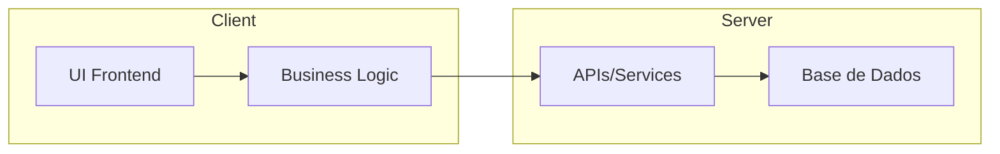

# 🧠 Cérebro Operante — Framework de Produção Universal

## 1. Filosofia de Produção

### Valores Centrais
- **Controle:** Decisões claras e rastreáveis em cada fase
- **Clareza:** Documentação direta, sem ambiguidades
- **Agilidade:** Entregas incrementais com feedback rápido
- **Modularidade:** Arquitetura desacoplada e reutilizável
- **Qualidade Sênior:** Testes, linting e revisão contínua

### Princípios de Decisão
1. **Priorização Baseada em Valor**
   - MVP sempre primeiro
   - Features por impacto/necessidade
   - Documentação como código

2. **Padrões Técnicos**
   - TypeScript/JavaScript para frontend
   - Lua para FiveM
   - oxmysql para persistência
   - QBXCore como framework base

3. **Ferramentas Essenciais**
   - Cursor AI para desenvolvimento
   - GitHub para versionamento
   - ChatGPT para documentação
   - Docusaurus para docs
   - GitHub Actions para CI/CD

## 2. Ciclo de Vida do Projeto

### 2.1 Análise de Requisitos
- **Entrada:** Prompt/Necessidade do cliente
- **Saída:** PRD estruturado
- **Profundidade:** Detalhamento completo de funcionalidades
- **Artefatos:** 
  - Documento de requisitos
  - User stories
  - Critérios de aceitação

### 2.2 Arquitetura
- **Entrada:** PRD aprovado
- **Saída:** Diagrama técnico e estrutura de pastas
- **Profundidade:** Componentes, eventos, fluxos
- **Artefatos:**
  - Diagrama de componentes
  - Estrutura de módulos
  - Definição de APIs

### 2.3 Prototipação
- **Entrada:** Arquitetura definida
- **Saída:** UI/UX funcional
- **Profundidade:** Wireframes e interações
- **Artefatos:**
  - Mockups
  - Protótipos interativos
  - Guias de estilo

### 2.4 Implementação
- **Entrada:** Protótipo aprovado
- **Saída:** Código funcional
- **Profundidade:** Clean code, testes unitários
- **Artefatos:**
  - Código fonte
  - Testes
  - Documentação técnica

### 2.5 Testes
- **Entrada:** Código implementado
- **Saída:** Sistema validado
- **Profundidade:** Cobertura completa
- **Artefatos:**
  - Relatórios de teste
  - Métricas de qualidade
  - Logs de execução

### 2.6 Deploy & Documentação
- **Entrada:** Sistema testado
- **Saída:** Sistema em produção
- **Profundidade:** Guias completos
- **Artefatos:**
  - Documentação de usuário
  - Guias de instalação
  - Changelog

## 3. Checklists Genéricos

### 3.1 Planejamento Inicial
- [ ] Definir objetivos e escopo (MVP)
- [ ] Identificar stakeholders e papéis
- [ ] Escolher APIs, frameworks e dependências centrais
- [ ] Documentar restrições e conformidades legais

### 3.2 Análise de Requisitos
- [ ] Coletar requisitos funcionais e não funcionais
- [ ] Definir critérios de aceitação
- [ ] Escrever casos de uso e user stories

### 3.3 Arquitetura
- [ ] Criar diagrama de alto nível (Mermaid)
- [ ] Definir módulos e responsabilidades
- [ ] Especificar integrações e contratos (APIs, eventos)

### 3.4 Design / UX
- [ ] Wireframes ou mockups das telas-chave
- [ ] Definir temas visuais e variações (dark/light)
- [ ] Validar responsividade e acessibilidade

### 3.5 Implementação
- [ ] Configurar boilerplate de projeto
- [ ] Integrar dependências principais
- [ ] Definir padrões de código (linting, formatação)
- [ ] Modularizar funcionalidades

### 3.6 Testes
- [ ] Escrever testes unitários (backend, frontend)
- [ ] Escrever testes de integração (end-to-end)
- [ ] Testar performance e carga

### 3.7 Deploy & Documentação
- [ ] Criar pipelines de CI/CD (build, test, lint)
- [ ] Gerar documentação automática (Markdown, Docusaurus)
- [ ] Definir versão e changelog
- [ ] Incluir guia de instalação e troubleshooting

## 4. Templates de Documentos

### 4.1 PRD (Product Requirements Document)
```markdown
# PRD — Nome do Projeto

## Visão Geral
- Objetivo:
- Público-alvo:

## Funcionalidades Principais
1. 
2. 

## Requisitos Funcionais
- RF1: ...
- RF2: ...

## Critérios de Aceitação
- CA1: ...
- CA2: ...

## Restrições
- 

## Roadmap de Entregas
1. Fase 1 — MVP
2. Fase 2 — Expansões
```

### 4.2 Arquitetura (Mermaid)


### 4.3 README Básico
```markdown
# Nome do Projeto

## Instalação
1. Clonar repositório
2. Instalar dependências
3. Configurar variáveis de ambiente
4. Iniciar aplicação

## Uso
- Comando ou instruções de execução

## Desenvolvimento
- Padrões de código
- Testes
- CI/CD
```

## 5. Métricas de Sucesso

### 5.1 Qualidade
- Cobertura de testes > 80%
- Zero vulnerabilidades críticas
- Documentação 100% atualizada

### 5.2 Performance
- Tempo de resposta < 100ms
- Uso de memória otimizado
- Zero memory leaks

### 5.3 Produtividade
- Deploy automático
- Feedback em < 24h
- Documentação gerada automaticamente 

## 5. Automação com GitHub Actions

### 5.1 Benefícios da Automação
- **Consistência:** Garante que todo código mergeado siga padrões comuns
- **Rapidez:** Feedback instantâneo para desenvolvedores após cada mudança
- **Qualidade:** Testes e verificações automatizadas impedem regressões
- **Escalabilidade:** Fácil adicionar novos jobs (performance, security, E2E)
- **Total Visibilidade:** Relatórios e status de cada pipeline ficam disponíveis no GitHub

### 5.2 Workflow Básico
```yaml
name: CI Workflow
on: [push, pull_request]

jobs:
  build:
    runs-on: ubuntu-latest
    steps:
    - uses: actions/checkout@v3
    
    - name: Setup Node.js
      uses: actions/setup-node@v3
      with:
        node-version: 18
        
    - name: Install Dependencies (NUI)
      run: |
        cd html && npm ci
        
    - name: Lint JavaScript
      run: |
        cd html && npm run lint
        
    - name: Lint Lua
      run: |
        find . -name "*.lua" -exec luacheck {} +
        
    - name: Run Tests
      run: |
        npm test && busted
        
    - name: Generate Documentation
      run: |
        npm run docs:build
        
    - name: Post-Analysis to AI
      run: |
        node scripts/analyze_with_gpt.js
        
    - name: Deploy to Staging
      if: github.ref == 'refs/heads/main'
      run: |
        npm run deploy:staging
```

### 5.3 Funcionalidades Automatizadas

#### 5.3.1 Validação de Padrões
- Linters (ESLint, Luacheck)
- Formatadores de código
- Testes unitários e de integração

#### 5.3.2 Construção de Artefatos
- Compilação da NUI
- Geração de bundles
- Otimização de assets

#### 5.3.3 Documentação Automática
- Atualização de README.md
- Geração de docs Docusaurus
- Atualização de diagramas Mermaid

#### 5.3.4 Análise de Código IA
- Revisão via OpenAI API
- Análise via Cursor AI
- Comentários automáticos em PRs

#### 5.3.5 Deploy Automatizado
- Deploy em staging
- Deploy em produção
- Rollback automático em caso de falha

### 5.4 Integração com IA

#### 5.4.1 Análise de Código
- Revisão automática de PRs
- Sugestões de melhorias
- Detecção de bugs potenciais

#### 5.4.2 Documentação
- Geração de documentação técnica
- Atualização de changelog
- Criação de guias de usuário

#### 5.4.3 Testes
- Geração de casos de teste
- Análise de cobertura
- Otimização de performance

### 5.5 Monitoramento e Métricas

#### 5.5.1 Qualidade
- Cobertura de testes
- Complexidade do código
- Vulnerabilidades

#### 5.5.2 Performance
- Tempo de build
- Tempo de deploy
- Uso de recursos

#### 5.5.3 Produtividade
- Tempo entre commits
- Taxa de sucesso de builds
- Tempo de resolução de issues 

## 6. Implementação Avançada de CI/CD

### 6.1 Configuração de Triggers Avançados

#### 6.1.1 Push em Branches
- main: Deploy em produção
- dev: Deploy em staging
- feature/*: Validação e testes

#### 6.1.2 Pull Requests
- Validação automática
- Análise de código
- Testes de integração

#### 6.1.3 Tags de Release
- Build automático
- Deploy em produção
- Geração de changelog

### 6.2 Matriz de Builds e Cache

#### 6.2.1 Estratégia de Build
```yaml
strategy:
  matrix:
    node-version: [16, 18]
    os: [ubuntu-latest, windows-latest]
  fail-fast: false
```

#### 6.2.2 Cache Inteligente
```yaml
steps:
  - name: Cache Node modules
    uses: actions/cache@v3
    with:
      path: ~/.npm
      key: ${{ runner.os }}-node-${{ matrix.node-version }}
      restore-keys: |
        ${{ runner.os }}-node-
```

### 6.3 Gestão de Secrets e Tokens

#### 6.3.1 Armazenamento Seguro
- GitHub Secrets para chaves de API
- Tokens de deploy
- Credenciais de banco de dados

#### 6.3.2 Rotação de Tokens
- Processo automático de renovação
- Validação de tokens expirados
- Notificação de expiração

### 6.4 Deploy Automatizado

#### 6.4.1 Ambientes
- Staging: Deploy automático
- Produção: Deploy com aprovação
- Rollback automático

#### 6.4.2 Monitoramento
- Health checks
- Métricas de performance
- Logs de deploy

### 6.5 Monitoramento e Alertas

#### 6.5.1 Quality Gates
- SonarCloud para qualidade
- Cobertura de testes
- Complexidade do código

#### 6.5.2 Notificações
- Slack/Teams
- Email
- GitHub Issues

#### 6.5.3 Métricas
- Tempo de build
- Cobertura de testes
- Tempo de deploy

### 6.6 Workflow Avançado

```yaml
name: Advanced CI/CD
on:
  push:
    branches: [main, dev, 'feature/*']
  pull_request:
    branches: [main, dev]
  release:
    types: [published]

jobs:
  validate:
    runs-on: ubuntu-latest
    strategy:
      matrix:
        node-version: [16, 18]
        os: [ubuntu-latest, windows-latest]
      fail-fast: false
    
    steps:
    - uses: actions/checkout@v3
    
    - name: Cache dependencies
      uses: actions/cache@v3
      with:
        path: ~/.npm
        key: ${{ runner.os }}-node-${{ matrix.node-version }}
        restore-keys: |
          ${{ runner.os }}-node-
    
    - name: Setup Node.js
      uses: actions/setup-node@v3
      with:
        node-version: ${{ matrix.node-version }}
    
    - name: Install dependencies
      run: npm ci
    
    - name: Run tests
      run: npm test
    
    - name: Run linting
      run: npm run lint
    
    - name: Quality check
      uses: SonarSource/sonarcloud-github-action@v1
      with:
        projectBaseDir: .
        args: >
          -Dsonar.projectKey=${{ secrets.SONAR_PROJECT_KEY }}
          -Dsonar.organization=${{ secrets.SONAR_ORGANIZATION }}
    
  build:
    needs: validate
    runs-on: ubuntu-latest
    if: success()
    
    steps:
    - uses: actions/checkout@v3
    
    - name: Build
      run: npm run build
    
    - name: Upload artifacts
      uses: actions/upload-artifact@v3
      with:
        name: build
        path: dist/
    
  deploy-staging:
    needs: build
    runs-on: ubuntu-latest
    if: github.ref == 'refs/heads/dev'
    
    steps:
    - uses: actions/checkout@v3
    
    - name: Download artifacts
      uses: actions/download-artifact@v3
      with:
        name: build
    
    - name: Deploy to staging
      run: npm run deploy:staging
    
    - name: Run smoke tests
      run: npm run test:smoke
    
  deploy-production:
    needs: [build, deploy-staging]
    runs-on: ubuntu-latest
    if: github.ref == 'refs/heads/main'
    environment: production
    
    steps:
    - uses: actions/checkout@v3
    
    - name: Download artifacts
      uses: actions/download-artifact@v3
      with:
        name: build
    
    - name: Deploy to production
      run: npm run deploy:prod
    
    - name: Notify team
      uses: actions/github-script@v6
      with:
        script: |
          github.rest.issues.create({
            owner: context.repo.owner,
            repo: context.repo.repo,
            title: 'Deploy Concluído',
            body: 'Deploy para produção concluído com sucesso!'
          }) 

## 7. Como Colocar Tudo em Funcionamento

### 7.1 Setup Inicial

#### 7.1.1 Estrutura do Repositório
- `mind.md` e `mind-flow.mermaid` na raiz
- Pasta `workflows/` com `ci.yml`
- Pasta `docs/` para documentação
- Pasta `scripts/` para automações

#### 7.1.2 Papéis e Responsabilidades
- **Team Leader:** visão global, coordenação
- **Product Manager:** requisitos e negócio
- **Architect:** arquitetura e integrações
- **Engineer:** implementação e testes
- **Data Analyst:** métricas e performance

### 7.2 Configuração Local

#### 7.2.1 Dependências
```bash
# Instalar dependências
npm install

# Linkar plugins locais
npm link .
```

#### 7.2.2 Teste Local
```bash
# Instalar act
brew install act  # macOS
choco install act-cli  # Windows

# Rodar workflow local
act push -P ubuntu-latest=nektos/act-environments-ubuntu:18.04
```

### 7.3 Fluxo de Execução

#### 7.3.1 Validação
- Linting e testes internos
- Geração de documentação
- Análise de código (opcional)

#### 7.3.2 Deploy
- Tokens em GitHub Secrets
- Deploy automático em staging
- Deploy em produção após aprovação

### 7.4 Monitoramento

#### 7.4.1 Métricas
- Tempo de build
- Cobertura de testes
- Tempo de deploy

#### 7.4.2 Alertas
- Notificações no GitHub
- Integração com Slack
- Relatórios de performance

### 7.5 Iteração e Refinamento

#### 7.5.1 Checklist
- Marcar itens concluídos
- Ajustar triggers
- Refinar templates

#### 7.5.2 Documentação
- Atualizar README
- Gerar changelog
- Manter docs atualizados

> O Cérebro Operante transforma seu repositório em um motor de produção sênior, garantindo eficiência, ordem e consistência em todo o processo de desenvolvimento. 

## 6. Requisitos do Plugin

### Requisitos Funcionais
- O plugin deve ser capaz de inicializar um novo projeto a partir de um template predefinido.
- O plugin deve validar a estrutura e o código do projeto, gerando relatórios de erros e avisos.
- O plugin deve permitir a integração com sistemas de CI/CD para automatizar o processo de build, teste e deploy.
- O plugin deve suportar a geração automática de documentação a partir do código fonte.
- O plugin deve permitir a extensão via sistema de plugins, facilitando a adição de novas funcionalidades.

### Requisitos Não Funcionais
- O plugin deve ser compatível com Node.js versão 14 ou superior.
- O plugin deve seguir as práticas de código limpo e padrões de codificação definidos no projeto.
- O plugin deve ser testado automaticamente via workflows de CI/CD.
- O plugin deve ser documentado de forma clara e acessível, permitindo que qualquer IA ou desenvolvedor possa entender e contribuir.
- O plugin deve ser escalável e modular, permitindo fácil manutenção e evolução. 