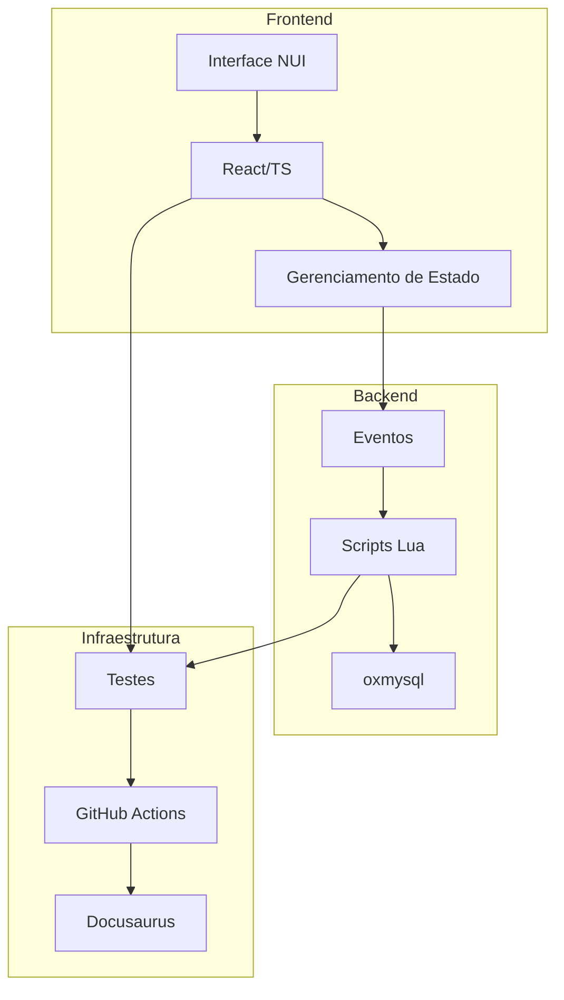
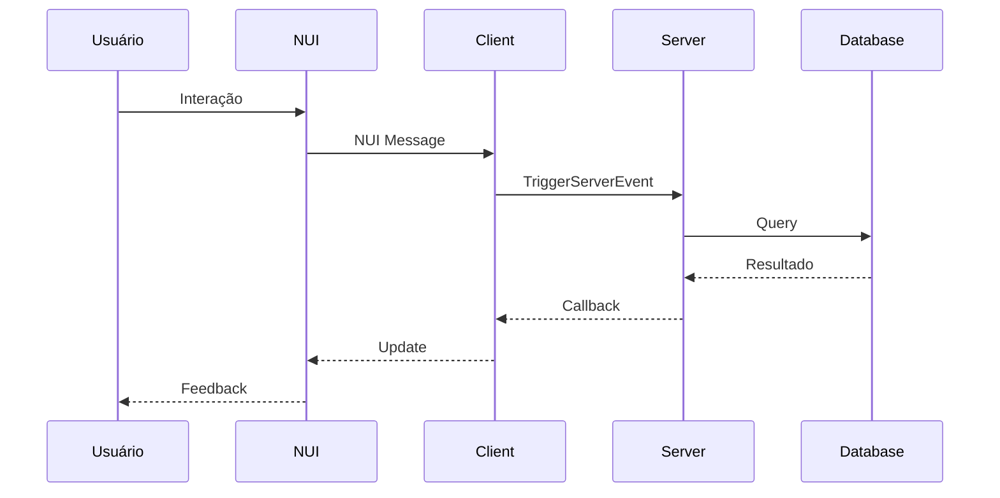
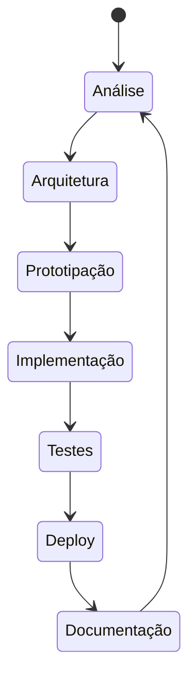

# 🧠 ThugAI Framework — Documentação do Projeto

## 1. Visão Geral

O ThugAI Framework é um sistema operacional de produção que padroniza o desenvolvimento de projetos FiveM, garantindo qualidade, consistência e eficiência em todo o ciclo de vida do software.

## 2. Arquitetura do Sistema

### 2.1 Componentes Principais



### 2.2 Fluxo de Dados



## 3. Estrutura de Diretórios

```
📦 thugai-framework
├── 📂 client
│   └── 📄 *.lua
├── 📂 server
│   └── 📄 *.lua
├── 📂 html
│   ├── 📂 src
│   └── 📂 dist
├── 📂 planning
│   └── 📄 checklist.md
├── 📂 templates
│   └── 📄 README.md
├── 📂 workflows
│   └── 📄 main.yml
├── 📄 mind.md
├── 📄 mind-flow.mermaid
├── 📄 config.lua
└── 📄 fxmanifest.lua
```

## 4. Tecnologias Utilizadas

### 4.1 Frontend
- React 18+
- TypeScript
- TailwindCSS
- Vite

### 4.2 Backend
- Lua 5.4
- QBXCore
- oxmysql
- ox_lib

### 4.3 Infraestrutura
- GitHub Actions
- Docusaurus
- Jest
- Busted

## 5. Fluxo de Desenvolvimento



## 6. Métricas e KPIs

### 6.1 Qualidade
- Cobertura de testes: > 80%
- Vulnerabilidades: 0 críticas
- Documentação: 100% atualizada

### 6.2 Performance
- Tempo de resposta: < 100ms
- Uso de memória: Otimizado
- Memory leaks: 0

### 6.3 Produtividade
- Deploy: Automático
- Feedback: < 24h
- Docs: Geradas automaticamente

## 7. Integrações

### 7.1 Desenvolvimento
- Cursor AI
- GitHub Copilot
- ESLint/Prettier
- TypeScript
- LuaLS

### 7.2 Infraestrutura
- GitHub Actions
- QBXCore
- oxmysql
- Docusaurus
- ChatGPT API

## 8. Segurança

### 8.1 Autenticação
- Sistema de autenticação obrigatório
- Máximo de 3 tentativas
- Banimento automático

### 8.2 Logs
- Nível: info
- Salvamento em arquivo
- Monitoramento contínuo

## 9. Documentação

### 9.1 Templates
- README.md
- CONTRIBUTING.md
- LICENSE
- CHANGELOG.md

### 9.2 Guias
- Instalação
- Configuração
- Desenvolvimento
- Deploy

## 10. Contribuição

### 10.1 Processo
1. Fork do projeto
2. Branch de feature
3. Commit das mudanças
4. Push para a branch
5. Pull Request

### 10.2 Padrões
- Clean Code
- Testes unitários
- Documentação atualizada
- Code review obrigatório

## PRD (Product Requirements Document)

### Funcionalidades
- **Inicialização de Projeto**: O plugin deve permitir a criação de um novo projeto a partir de templates predefinidos, facilitando o início rápido de novos projetos.
- **Validação de Código**: O plugin deve validar a estrutura e o código do projeto, gerando relatórios de erros e avisos para garantir a qualidade do código.
- **Integração com CI/CD**: O plugin deve se integrar com sistemas de CI/CD para automatizar o processo de build, teste e deploy, garantindo consistência e eficiência.
- **Geração de Documentação**: O plugin deve suportar a geração automática de documentação a partir do código fonte, facilitando a manutenção e o entendimento do projeto.
- **Sistema de Plugins**: O plugin deve permitir a extensão via sistema de plugins, facilitando a adição de novas funcionalidades e a personalização do projeto.

### Fluxos de Usuário
- **Inicialização**: O usuário executa o comando de inicialização, seleciona um template e o plugin cria a estrutura do projeto.
- **Validação**: O usuário executa o comando de validação, e o plugin analisa o código, gerando relatórios de erros e avisos.
- **Deploy**: O usuário executa o comando de deploy, e o plugin automatiza o processo de build, teste e deploy, garantindo a entrega consistente.

### Integrações
- **GitHub Actions**: O plugin deve se integrar com GitHub Actions para automatizar os processos de CI/CD.
- **ESLint e Luacheck**: O plugin deve utilizar ESLint para validação de código JavaScript/TypeScript e Luacheck para Lua.
- **Sistema de Documentação**: O plugin deve se integrar com ferramentas de geração de documentação, como JSDoc ou TypeDoc.

### Métricas de Sucesso
- **Qualidade do Código**: Redução no número de erros e avisos após a validação.
- **Eficiência do Deploy**: Tempo reduzido para deploy e número de falhas no processo de CI/CD.
- **Satisfação do Usuário**: Feedback positivo dos usuários sobre a facilidade de uso e a eficácia do plugin. 